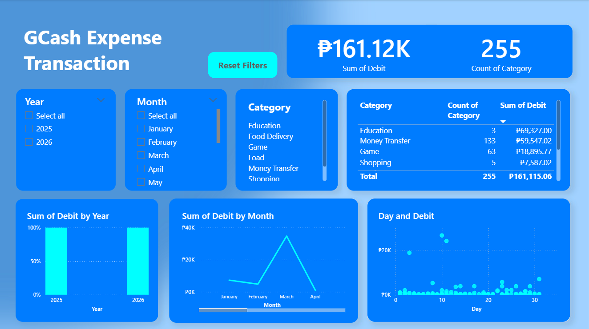

# GCash Spending Behavior Analysis

---

**Project Overview**

This project analyzes one year of personal GCash transaction data to understand spending behavior, category distribution, transaction frequency, and monthly trends.

The dashboard was built using Power BI and includes interactive filters for year, month, and category selection.

---

**Key Insights**

- Identified top spending categories.

- Analyzed monthly expense trends.

- Compared income vs expenses over time.

- Evaluated transaction frequency patterns.